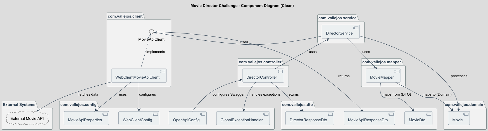
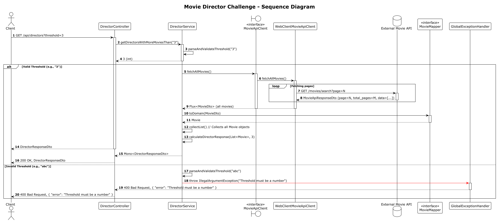

# Movie Director Challenge Solution

[Spanish Version of this README](README-ES.md)

This project presents a robust and well-architected solution to the [Domus Back-End Developer Challenge](challenge.md). It's a 100% academic exercise demonstrating modern Java and Spring Boot development practices.

The core task is to build a REST API endpoint that, given a numerical threshold, returns a sorted list of directors who have directed more movies than the specified threshold. Movie data is sourced from an external API, requiring intelligent pagination handling and resilient communication.

## Challenge Description
For a detailed understanding of the original problem statement, please refer to the [challenge.md](challenge.md) file.

## Key Features

*   **Reactive Programming**: Built with Spring WebFlux for non-blocking, asynchronous operations, ensuring high concurrency and efficient resource utilization.
*   **Intelligent Pagination**: The external movie API is consumed efficiently using Reactor's `expand` operator to fetch all pages concurrently, optimizing data retrieval.
*   **Robust External API Client**: Implemented with `WebClient` and configured with connection and response timeouts to prevent resource exhaustion and improve resilience against slow or unresponsive external services.
*   **Layered Architecture**: Clear separation of concerns across Controller, Service, Client, Mapper, Domain, and DTO layers, promoting maintainability and scalability.
*   **Dependency Inversion Principle (DIP)**: The `DirectorService` depends on the `MovieApiClient` interface, allowing for easy swapping of API client implementations without affecting business logic.
*   **Strongly Typed Configuration**: External API base URLs are managed using `@ConfigurationProperties`, providing type-safe and organized configuration.
*   **Efficient Object Mapping**: Utilizes MapStruct for compile-time generation of mappers between DTOs and domain objects, eliminating boilerplate code and improving performance.
*   **Domain-Driven Behavior**: Encapsulates business logic within the domain model (e.g., `Movie::hasDirector`), adhering to the "Tell, Don't Ask" principle.
*   **Comprehensive Error Handling**: A global exception handler (`GlobalExceptionHandler`) provides consistent and user-friendly error responses for invalid inputs.
*   **Immutable Collections**: Leverages Java 16's `Stream.toList()` for creating immutable lists, enhancing code safety and predictability.
*   **Thorough Testing Strategy**: Includes unit tests for core components (Client, Service, Mapper, Domain, Exception Handler) and integration tests for the API endpoint, ensuring high code quality and reliability.
*   **OpenAPI (Swagger) Documentation**: Automatically generated API documentation for easy understanding and consumption of the endpoint.

## Technologies Used

*   **Java 17**: The core language version.
*   **Spring Boot 3.4.12**: Framework for building the application.
*   **Spring WebFlux**: For reactive programming model.
*   **Project Reactor**: Foundation for reactive streams.
*   **Lombok**: Reduces boilerplate code (getters, setters, constructors).
*   **MapStruct 1.5.5.Final**: Code generator for object mapping.
*   **SpringDoc OpenAPI 2.2.0**: Integrates Swagger UI for API documentation.
*   **Gradle**: Build automation tool.
*   **JUnit 5 & Mockito**: For testing.
*   **Reactor Test**: For testing reactive streams.

## Architectural Design & Improvements (Seniority Aspects)

This solution goes beyond merely fulfilling the challenge requirements by incorporating several best practices and design patterns indicative of a senior development approach:

*   **Clear Separation of Concerns**: Each component (Controller, Service, Client, Mapper, Domain, DTO) has a single, well-defined responsibility.
*   **Robustness & Resilience**: Implementation of timeouts and proper error propagation in the `WebClient` ensures the application can gracefully handle external service failures.
*   **Testability**: The architecture is designed for maximum testability, allowing for isolated unit tests of business logic, mappers, and client behavior, alongside integration tests for the API layer.
*   **Maintainability & Readability**: Use of MapStruct, Lombok, and Javadoc, combined with a clean code structure, makes the codebase easy to understand, maintain, and extend.
*   **Scalability**: The reactive nature of WebFlux and efficient pagination handling are foundational for building scalable microservices.
*   **Configuration Management**: Externalizing configuration with `@ConfigurationProperties` allows for flexible deployment across different environments without code changes.

## UML Diagrams

For a better understanding of the application's architecture and flow, the following UML diagrams are included:

### Component Diagram


### Sequence Diagram


## How to Run

1.  **Prerequisites**: Ensure you have Java 17 installed.
2.  **Clone the repository**:
    ```bash
    git clone https://github.com/your-username/MovieDirectorChallenge.git
    cd MovieDirectorChallenge
    ```
3.  **Run the application using Gradle**:
    ```bash
    ./gradlew bootRun
    ```
    The application will start on `http://localhost:8080`.

## API Usage

The application exposes a single REST endpoint:

### Get Directors by Movie Count Threshold

Retrieves a list of directors who have directed more movies than the specified threshold.

*   **URL**: `/api/directors`
*   **Method**: `GET`
*   **Query Parameter**:
    *   `threshold` (required): An integer representing the minimum number of movies a director must have (strictly greater than this value).
        *   **Example**: `?threshold=3`
        *   **Validation**:
            *   Non-numeric values will result in a `400 Bad Request`.
            *   Negative values will return an empty list of directors.

*   **Example Request**:
    ```
    GET http://localhost:8080/api/directors?threshold=3
    ```

*   **Example Success Response (200 OK)**:
    ```json
    {
        "directors": [
            "Clint Eastwood",
            "M. Night Shyamalan",
            "Martin Scorsese",
            "Pedro Almodóvar",
            "Quentin Tarantino",
            "Woody Allen"
        ]
    }
    ```

*   **Example Error Response (400 Bad Request)**:
    ```json
    {
        "error": "Threshold must be a number"
    }
    ```

## Testing

To run all tests (unit and integration):

```bash
./gradlew test
```

## Swagger Documentation

Access the interactive API documentation (Swagger UI) at:

```
http://localhost:8080/webjars/swagger-ui/index.html
```

## Contribution

If you wish to contribute to this project, please follow these steps:
1.  Fork the repository.
2.  Create a new branch for your feature or bugfix.
3.  Make your changes and ensure all tests pass.
4.  Submit a pull request to the main branch.

## License

This project is purely academic and developed as a solution to the Domus Back-End Developer Challenge.

## Contact

For any questions or suggestions, feel free to contact Pablo.
